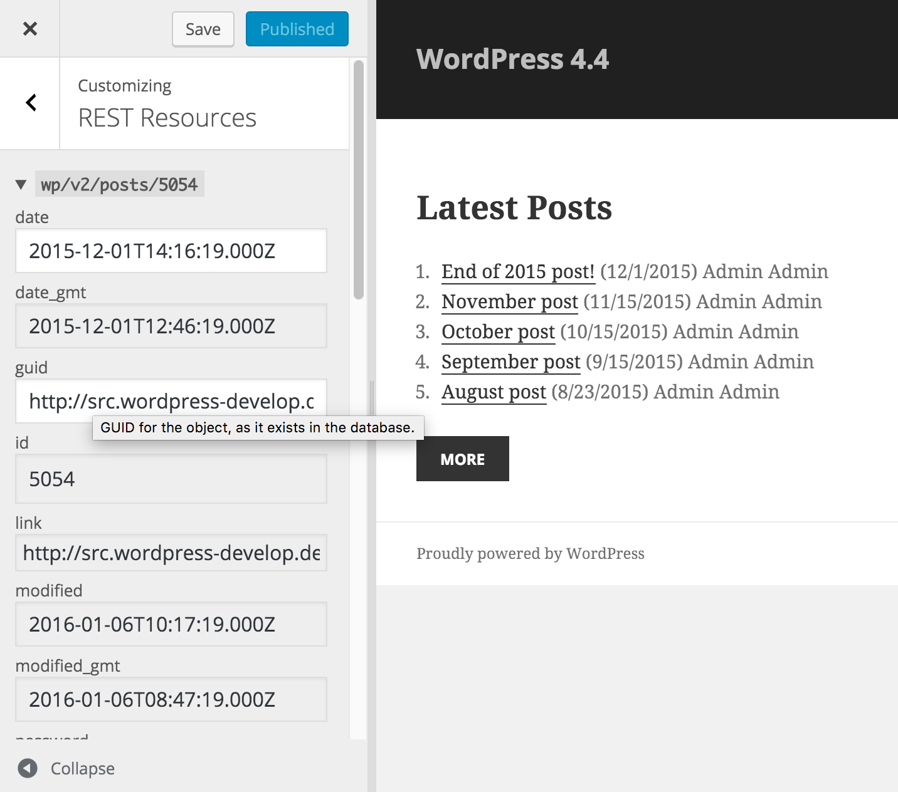
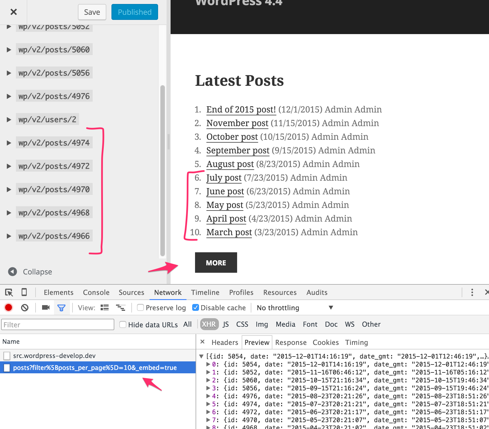

<!-- DO NOT EDIT THIS FILE; it is auto-generated from readme.txt -->
# Customize REST Resources

Edit any resource fetched from the WP REST API in the Customizer, with fields automatically constructed from the schema.

**Contributors:** [westonruter](https://profiles.wordpress.org/westonruter), [xwp](https://profiles.wordpress.org/xwp)  
**Requires at least:** 4.7  
**Tested up to:** 4.7  
**Stable tag:** trunk (master)  
**License:** [GPLv2 or later](http://www.gnu.org/licenses/gpl-2.0.html)  

   

## Description ##

*See the [Bridging the Customizer and the WP REST API](https://make.xwp.co/2016/01/06/bridging-the-customizer-and-the-wp-rest-api/) introductory post.*

The WP REST API provides a rich machine-readable interface for programmatically making changes to WordPress. The changes made, however, cannot be previewed. The Customizer is WordPress's framework for live previewing any change, and this can include changes made to REST resources. And this is what this plugin implements. The REST endpoints provide a uniform abstraction layer on top of a diverse array of WordPress API calls. Implementing Customizer setting for all of WordPress's object types would require creating a new `WP_Customize_Setting` subclass for each with unique implementations for the `update`, `value`, `sanitize`, and `preview` methods. With the REST API, however, we have a uniform input (request) and output (response) interface that a single Customizer setting can be implemented to interact with. Each REST resource is represented by a Customizer setting. Since each endpoint (should) provide a schema for describing what the resources at those endpoints look like, the Customizer can read from this schema to `sanitize` and validate the REST resource prior to being sent along for `update`. Implementing `preview` for a REST resource involves filtering the REST Server response.

With the REST API providing a schema for a given resource, we also have the ability to automatically generate the controls for this resource with fields that have the appropriate control types (dropdowns, checkboxes, etc) and value types (boolean, integer, string, etc).

When the WP API JS client is used, where REST resources are encapsulated in Backbone models, this plugin will opt-in the relevant REST resource setting for `postMessage` transport. Assuming that the JS app is developed in a way where the view will be re-rendered in response to model changes, when the Customizer syncs a setting for a REST resource into the preview, the model can likewise be updated when the setting is changed in the preview, resulting in a live preview of a JS application in the Customizer without any full-page refresh or even selective refresh ([#27355](https://core.trac.wordpress.org/ticket/27355)).

This plugin is closely related to the [Customizer Transactions](https://make.wordpress.org/core/2015/01/26/customizer-transactions-proposal/) proposal in that it allows Ajax requests made in the Customizer preview to have customizations applied to them. With Transactions the customizations would apply to all requests, but with this plugin they only apply to the REST API requests made to the site's endpoint.

The Customize REST Resources plugin is closely related to [A more RESTful WP-CLI](https://www.kickstarter.com/projects/danielbachhuber/a-more-restful-wp-cli/description) which seeks to “unlock the potential of the WP REST API at the command line” in that “all WP REST API endpoints registered via plugins and themes will _automagically_ be usable as WP-CLI commands”. In the same way, Customize REST Resources begins to unlock the potential of the WP REST API in the _Customizer_ by automatically creating settings and controls for all REST resources that are used on a given page. In this way, **anything developed for the REST API should automatically be available in the Customizer**.

Here's a quick demo of an alpha state of this plugin when used with the [Next Recent Posts](https://github.com/xwp/wp-next-recent-posts-widget) widget:

This plugin works best with the [Customize Setting Validation](https://github.com/xwp/wp-customize-setting-validation) feature plugin.

Please note that this plugin depends on the bleeding-edge development version of the [Backbone JS client for the WP-API](https://github.com/WP-API/client-js), which as of 2016-01-05 was not yet upstreamed into the main [WP-API plugin](https://github.com/WP-API/WP-API).

## Limitations ##

* Plugin will not be able to customize JSONP requests to the WP REST API, due to how it needs to rewrite Ajax requests using `jQuery.prefilter`.
* REST resources can only be customized if they are served by the WordPress site being previewed. As such, Customizing headless WordPress-driven sites is not yet possible.
* Fields that have `raw` and `rendered` properties will be exposed as a single input tied to the `raw` property. Modifying the `raw` will supply the `raw` value to the `rendered` property. In the future, there should be an Ajax request which applies the rendering logic to the `raw` value so that it can be previewed properly.
* Only existing REST resources can be customized. It is not yet possible to create new resources in the Customizer.

## Screenshots ##

### REST resources used in preview are added as controls in the REST Resources panel.

### Fields in the REST resource control are created from the schema.

### New REST resources fetched via Ajax are automatically added to the REST Resources panel.

### JS apps using the WP API Backbone client get live preview `postMessage` updates.

